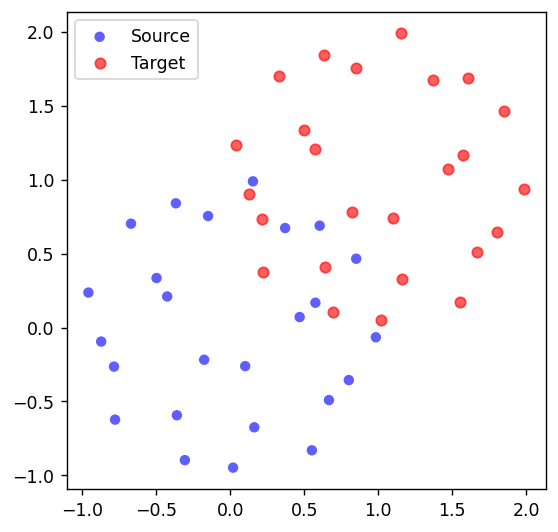
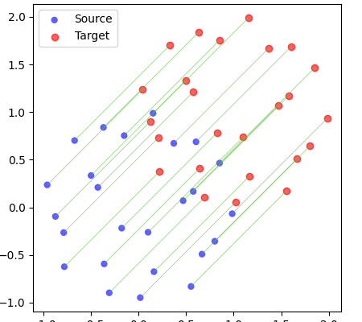
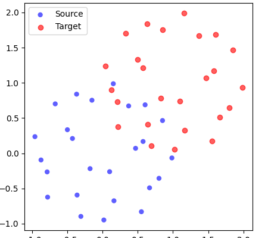

======
otcyto
======

    Compute optimal transport based distances and mappings between point clouds, especially for cytometry data.

**otcyto** is a Python package for computing and visualizing
*optimal transport*-based distances and mappings between
point clouds, with a focus on cytometry-like data.
It combines **PyTorch**, **GeomLoss**, and optional **PyKeOps** acceleration
to deliver GPU-accelerated performance, clear APIs, and plotting tools
for inspecting results.

Overview
--------
The package is designed for researchers and engineers who need to:

* Quantify distributional differences between samples
* Map one sample onto another via an optimal transport plan or Brenier map.
* Visualize the mapping process and alignment quality.
* Integrate optimal transport distances into larger cytometry analysis pipelines.

Core functionality is centered on the ``OTDPairwise`` class for
pairwise optimal transport distances, supported by utilities for
generating synthetic data and producing high-quality figures.

Features
--------
* **Pairwise Optimal Transport Distance (OTD)** computation between lists of point clouds.
* **Multiple output formats** — PyTorch tensor, NumPy array, and pandas DataFrame.
* **GPU acceleration** via CUDA, with automatic device placement.
* **Optional PyKeOps backend** for large-scale speedups.
* **Brenier map computation** for geometric interpretation of transport.
* **Plotting utilities** for OTD matrices, Brenier maps, and point cloud overlays.
* **Synthetic data generators** for testing and demonstration.

Installation
------------
Install from PyPI::

    pip install otcyto

Or with **uv** for fast, reproducible installs::

    uv pip install otcyto

Optional acceleration:

* **PyKeOps** for GeomLoss speedups::

    pip install pykeops

Verify installation::

    from otcyto.check_pykeops import check_pykeops
    assert check_pykeops()

Minimal Working Example
-----------------------
Compute a 1x2 OTD matrix between one source and two shifted targets,
plot the OTD heatmap, and visualize point clouds.

.. code-block:: python

    from otcyto.geomloss.create_sphere import create_sphere
    from otcyto.otd_pairwise import OTDPairwise
    from otcyto.plot.figure_clouds import figure_clouds

    # Create synthetic point clouds
    n = 1_000
    source = create_sphere(n)[0]
    target_1 = create_sphere(n)[0] + 1
    target_2 = create_sphere(n)[0] + 2

    # Compute pairwise OTD
    otd = OTDPairwise([source], [target_1, target_2])
    otd.compute()

    # Inspect results
    print(otd.otd_df)

    # Plot and save OTD matrix
    otd.plot().savefig("otd_matrix.png")

    # Optional: plot Brenier map for first target
    otd.plot_brenier(0, 0).savefig("brenier_map.png")

    # Overlay point clouds
    figure_clouds(source, target_1).savefig("clouds.png")

Usage Notes
-----------
* The ``loss`` parameter of ``OTDPairwise`` accepts a custom
  ``geomloss.SamplesLoss`` instance for full control over Sinkhorn
  parameters.

Development Package setup
=========================

This project has been set up using PyScaffold 4.4. For details and usage
information on PyScaffold see https://pyscaffold.org/

.. code-block:: bash

    pip install --upgrade pyscaffold
    putup otcyto
    cd otcyto
    # Create otcyto within gitlab, without README
    git branch -m master main
    git remote add origin git@github.com:ggrlab/otycyto
    git push -u origin --all

    # add-apt-repository ppa:deadsnakes/ppa
    # apt install python3.11

    #  Use uv-managed virtualenv
    # uv sync  --python /bin/python3.11

    # (Optional) Add deps with uv (writes to pyproject.toml) to testing:
    uv add --dev pytest ruff pytest-cov pre-commit
    # Use pre-commit:
    # https://docs.astral.sh/uv/guides/integration/pre-commit/

    uv sync  --python /bin/python3.11  # or whatever python you want to use.
    # Using your default python:
    # uv sync
    uv run pre-commit run --all-files
    uv run pre-commit autoupdate
    # uv sync including test dependencies:

    # Run common tasks via uv
    uv run pytest                # tests
    uv build                     # build sdist/wheel when ready to publish
    # uv publish  # to publish on pypi

    # Pre-commit with Ruff via PyScaffold extension
    # If you haven’t used the extension on creation:
    pipx run pyscaffold putup --update . --pre-commit-ruff
    pre-commit install
    pre-commit autoupdate

    # Run the CI locally with act. (pure development)
    wget https://github.com/nektos/act/releases/download/v0.2.80/act_Linux_x86_64.tar.gz
    tar -xzf act_Linux_x86_64.tar.gz
    sudo mv act /usr/local/bin/
    rm act_Linux_x86_64.tar.gz

    # From https://github.com/nektos/act/blob/a78b3f305a43a143283fb7d02f3b24df1577ce3e/cmd/root.go#L719
    # 	switch answer {
    # 	case "Large":
    # 		option = "-P ubuntu-latest=catthehacker/ubuntu:full-latest\n-P ubuntu-22.04=catthehacker/ubuntu:full-22.04\n-P ubuntu-20.04=catthehacker/ubuntu:full-20.04\n-P ubuntu-18.04=catthehacker/ubuntu:full-18.04\n"
    # 	case "Medium":
    # 		option = "-P ubuntu-latest=catthehacker/ubuntu:act-latest\n-P ubuntu-22.04=catthehacker/ubuntu:act-22.04\n-P ubuntu-20.04=catthehacker/ubuntu:act-20.04\n-P ubuntu-18.04=catthehacker/ubuntu:act-18.04\n"
    # 	case "Micro":
    # 		option = "-P ubuntu-latest=node:16-buster-slim\n-P ubuntu-22.04=node:16-bullseye-slim\n-P ubuntu-20.04=node:16-buster-slim\n-P ubuntu-18.04=node:16-buster-slim\n"
    # 	}
    # Use the medium image for act:
    echo "-P ubuntu-latest=catthehacker/ubuntu:act-latest\n-P ubuntu-22.04=catthehacker/ubuntu:act-22.04\n-P ubuntu-20.04=catthehacker/ubuntu:act-20.04\n-P ubuntu-18.04=catthehacker/ubuntu:act-18.04\n" > .actrc
